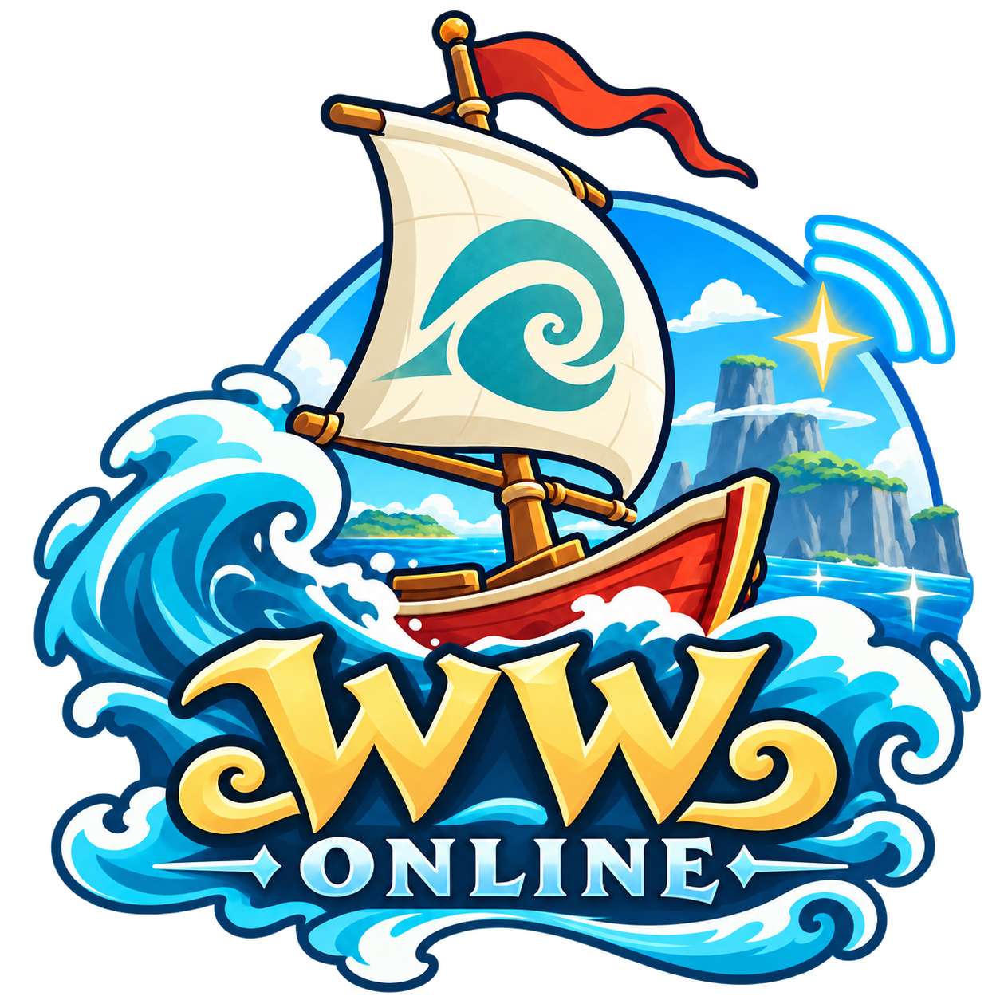
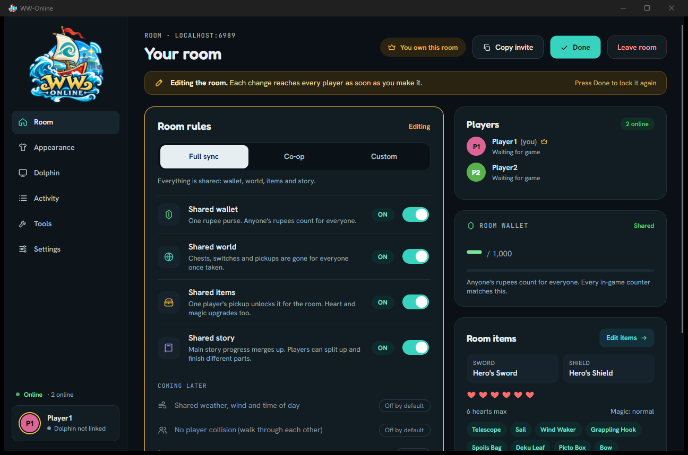
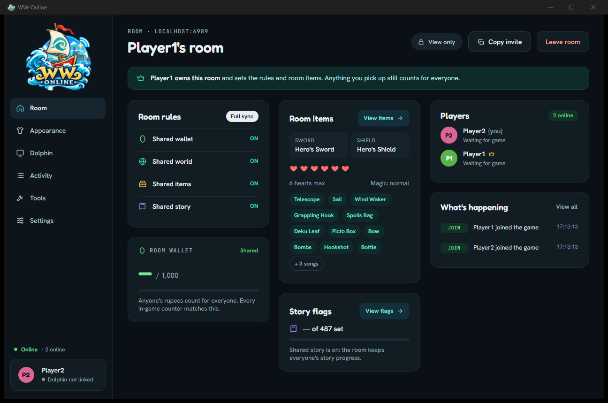
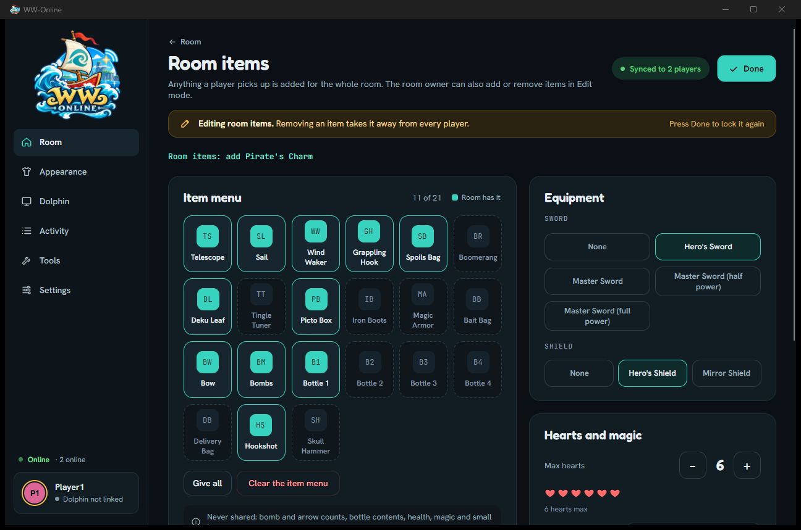
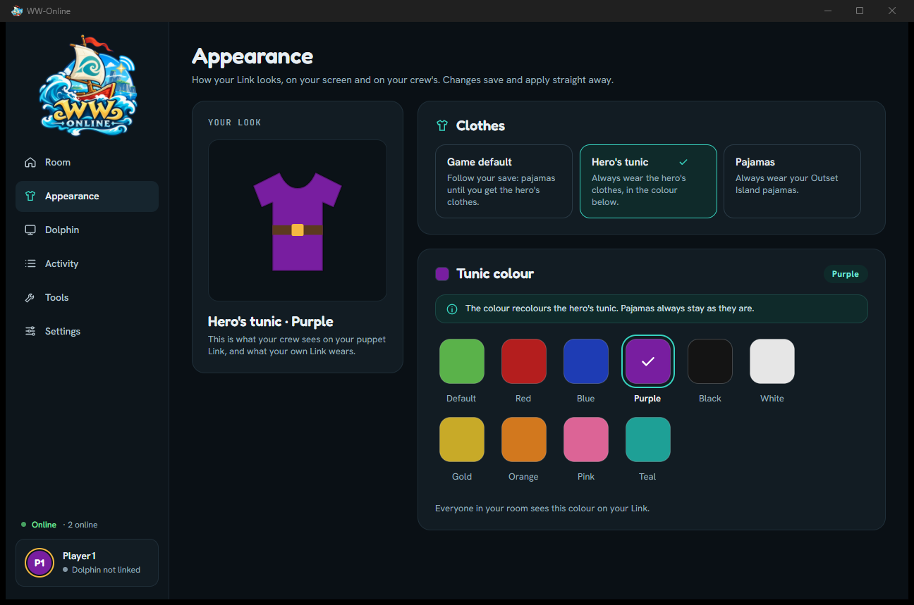
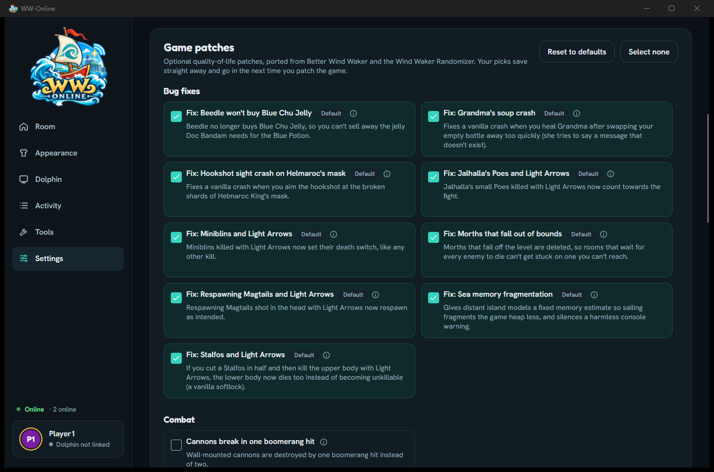

<p align="center">
  
</p>

<h3 align="center">Online multiplayer for The Legend of Zelda: The Wind Waker</h3>

<p align="center">
  Sail the Great Sea with your friends. Everyone plays their own copy of the game in Dolphin,<br>
  and WW-Online brings the other players into your world as fully animated Links and keeps your adventure in sync.
</p>

<p align="center">
  <a href="https://github.com/datstarkey/ww-online/releases/latest"></a>
  <a href="https://github.com/datstarkey/ww-online/releases"></a>
  <a href="LICENSE"></a>
  
  
</p>

<p align="center">
  <a href="#install"><b>Install</b></a> ·
  <a href="#play"><b>Play</b></a> ·
  <a href="#what-it-does"><b>Features</b></a> ·
  <a href="#troubleshooting"><b>Troubleshooting</b></a> ·
  <a href="#building-from-source"><b>Build from source</b></a> ·
  <a href="#credits"><b>Credits</b></a>
</p>

<p align="center">
  
</p>

> **You need your own copy of the game.** WW-Online contains no Nintendo code, files or assets, and never will. It patches the game on your PC from a disc image you provide: a US copy of The Wind Waker (game ID `GZLE01`) that you dumped from a disc you own. Please don't ask for, or share, game files.

> **Status: early development.** Things work, and things break. Expect bugs, and expect everyone in a room to need the same WW-Online version.

## What it does

**See each other**
- Other players appear as real Links: running, rolling, crouching, sword combos, shield, sheathing and the Master Sword glow.
- They climb like you do: ledge grabs, hanging and shimmying, ladders and vine walls, sidling along walls, pushing and pulling blocks, and crawling.
- Their equipment shows: sword, shield (including the Mirror Shield) and hero's clothes or pajamas.
- They hold and use their items: bow (with aim), boomerang, hookshot, Deku Leaf, Skull Hammer, Wind Waker, bottles, telescope, Picto Box, Tingle Tuner, and a carried bomb with a burning fuse.
- Each player picks their own tunic colour (black Link, purple Link, anything), and everyone sees it change live.
- Player names above heads: each player's name floats above their Link, in the game's own font. It shrinks with distance and hides in cutscenes and menus (turn it off under **Appearance**).
- Out on the Great Sea you see each other sailing in your own King of Red Lions, with the sail in their tunic colour, and their cannon or salvage crane when they take it out.
- You see up to three other players at once.

**Play one adventure together (a "room")**

One player hosts a room and becomes the **room owner**. The owner picks how much the room shares:

| Rule | What it means |
|------|---------------|
| **Shared wallet** | One rupee purse. Anyone's rupees count for everyone. |
| **Shared world** | Chests, switches and pickups are gone for everyone once someone takes them, and it happens live if you're in the same room: a chest opens empty, a bombed wall vanishes, a locked door comes back unlocked, and a ladder drops or a torch lights when another player clears the room. Small keys too: a key anyone finds is everyone's, and a door anyone unlocks uses it up for everyone. |
| **Shared items** | One player finding an item unlocks it for the whole room, including heart containers and the magic meter. |
| **Shared story** | Main story progress is shared, so you can split up and finish different parts of the game. |
| **Shared bait bag** | One stock of All-Purpose Bait and Hyoi Pears. Anyone's purchase, pickup or use counts for everyone. |
| **Shared spoils bag** | One stock of Joy Pendants, Skull Necklaces, Chu Jellies, Knight's Crests and the other spoils. Anyone's pickup, sale or trade counts for everyone. |
| **Other players' projectiles** | Other players' bombs, boat-cannon shots and arrows are real in your game: they fly, explode and hit your enemies and walls. Off: you still see them carry a bomb or aim, but nothing flies. |
| **Allow warping** | A **Warp to** button on each player in the Players list. In the same area it moves you next to them. Anywhere else it takes you to the entrance they came in through. |

- **Full sync** turns everything on. **Co-op** turns the six shared-progress rules and warping off, so you see each other (and each other's projectiles) but keep your own progress.
- Joining a room never throws away progress: if you're further ahead than the room, your progress is added to it.
- Never shared: health, magic, bomb and arrow counts, and bottle and delivery bag contents (the bait and spoils bags only with their Shared rules).
- The Room page's **Dungeons** card shows each dungeon's small keys, map, compass, big key and boss.
- The app's item icons are read from your own game files and stay on your PC.

**Planned:** shared weather, wind and time of day (off by default), a "no player collision" option (players bump into each other today), PVP and riding in each other's boats.

<table>
  <tr>
    <td width="50%"></td>
    <td width="50%"></td>
  </tr>
  <tr>
    <td align="center"><sub>Everyone else sees the room read-only, with what's happening live.</sub></td>
    <td align="center"><sub>The room owner decides the room's items. Nothing changes until you press Edit.</sub></td>
  </tr>
  <tr>
    <td width="50%"></td>
    <td width="50%"></td>
  </tr>
  <tr>
    <td align="center"><sub>Pick your clothes and tunic colour. Everyone in the room sees it live.</sub></td>
    <td align="center"><sub>Choose optional game patches, then press Patch game.</sub></td>
  </tr>
</table>

## Requirements

- **Windows 10 or 11**, 64-bit.
- **[Dolphin](https://dolphin-emu.org/download/)**, a recent development build.
- **Your own Wind Waker disc image**: the US version, `GZLE01`, dumped from your own disc (ISO, RVZ, GCM…).
- **Friends to play with**, and a way to reach each other over the internet (see [Playing over the internet](#playing-over-the-internet)).

## Install

1. **Download WW-Online** from the [Releases](../../releases) page (`WWOnline-win-Setup.exe`) and run it. It installs for your user only (no admin needed), adds shortcuts, and updates itself when a new version comes out. Everything it needs, including .NET, is bundled.
   - Windows may say **"Windows protected your PC"** because the installer isn't code-signed yet. Click **More info → Run anyway**.
2. **Get [Dolphin](https://dolphin-emu.org/download/)** (a recent development build) and unzip it anywhere.
3. **Open WW-Online.** The first time, a short setup walks you through everything (run it again any time from **Settings → Run setup again**):
   - **Dolphin**: it looks for `Dolphin.exe` for you, or you browse to it.
   - **Your game**: choose your disc image (ISO, RVZ, GCM…) and WW-Online extracts it with DolphinTool, which comes with Dolphin. (With an older Dolphin that has no DolphinTool, extract it yourself: add the ISO to Dolphin's game list, right-click the game → **Properties** → **Filesystem** → right-click the disc at the top → **Extract Entire Disc…**, then choose that folder.) WW-Online checks it's the US version, `GZLE01`. Then choose a folder for the patched copy: the original is only read, never changed.
   - **Game patches**: optional extras (skip the intro, instant text, Swift Sail, faster animations, crash fixes and more, from Better Wind Waker). The defaults are a good start. Patches marked **All players should match** change the world, so agree on those with your room.
   - **You**: your name and tunic colour.
   - **Patch**: builds your patched game. The first time copies the whole game (about 1.5 GB), so it can take a minute.

   Patch again only when WW-Online asks: after an update that changes the game code, or when you change your patches. Until the game is patched and up to date, a banner at the top says so (with **Patch now**), and WW-Online won't start Dolphin or attach to it.
4. **Dolphin's memory setting.** WW-Online needs Dolphin's 48 MB memory setting, and turns it on by itself (for that session only) when it starts Dolphin for you. If you start Dolphin yourself, open **Config** → **Advanced**, tick **Enable Emulated Memory Size Override** and set **MEM1** to **48 MB**.

## Play

- **Host a room:** on the **Room** page choose **Host a room**. WW-Online starts the room on your PC (port `6969`), then starts your patched game in Dolphin and links up with it (turn that off in **Settings**). You're the room owner: press **Edit room** to pick Full sync, Co-op or your own mix of rules. Rules stay locked until you press Edit, so nothing changes by accident.
- **Join a room:** enter the host's address and your name, then **Join**. WW-Online starts your game in Dolphin the same way. You see the room's rules and items read-only, and anything you pick up still counts for the room.
- **Your look:** open **Appearance** to pick your clothes (game default, hero's tunic or pajamas) and your tunic colour. It changes live for everyone. **Show player names** there turns the names above the other Links on or off, for your screen only.
- **Story flags:** on the **Room** page, see which story events the room has reached. The room owner can edit them.
- **Warp to a player:** with **Allow warping** on, press **Warp to** next to a player on the **Room** page. In the same area you're moved next to them; anywhere else you arrive at the entrance they came in through (the door or loading zone they used).
- **Dolphin** shows the connection to your game and your live stats. **Start game** starts it by hand; **Attach** links up with a Dolphin you started yourself.
- **Tools** holds local-only helpers (warp, stats, memory). They only affect your own game.

### Playing over the internet

The host's PC must be reachable on port `6969`. The easiest options:
- **[Tailscale](https://tailscale.com/)** (recommended): everyone installs it and joins the host's tailnet, then connects to the host's Tailscale IP. No router changes needed.
- **Port forwarding:** forward TCP `6969` on the host's router to the host's PC, and friends connect to the host's public IP.
- **Dedicated server:** run the server on any always-on machine or VPS, and everyone connects to it. There's a Docker image (amd64 and arm64):
  ```
  docker run -d --name ww-online --restart unless-stopped -p 6969:6969 ghcr.io/datstarkey/ww-online-server:latest
  ```
  [Self-hosting](docs/self-hosting.md) covers Docker Compose, the settings, the optional owner key (so the right player owns the room), firewalls, Tailscale and TLS. The release zips run without Docker too.

## Troubleshooting

- **Stuck? Warp to a player.** Shared story and world only ever move forward, so when another player does something that moves them on (say, leaving Outset Island with Tetra), the others can find their own way forward gone. Press **Warp to** next to that player on the **Room** page (the room's **Allow warping** rule must be on). [Softlocks](docs/softlocks.md) lists the known cases and how warping works.
- **Purple screen with `d_s_play.cpp` / black screen on boot:** the 48 MB memory setting is off (install step 4; only when you start Dolphin yourself), or the game folder isn't a patched `GZLE01` copy.
- **WW-Online says to patch your game, and won't start Dolphin:** the game isn't patched yet, WW-Online was updated with new game code, or you changed your patches. Press **Patch now** in the banner (or **Settings → Patch game**).
- **WW-Online won't link up with a Dolphin you started yourself:** the running game must be your patched `GZLE01` copy, with the 48 MB memory setting on (install step 4). A vanilla or PAL game is refused.
- **Players don't appear:** everyone must be on the same WW-Online version, in the same room, and past the title screen. You see a player when you're in the same room of the same stage (on the Great Sea, when they're close).
- **Can't connect:** check the host address and port, and see [Playing over the internet](#playing-over-the-internet). A "different version" message means someone needs to update.
- **Item icons are missing:** **Settings → Item icons → Read icons from game** reads them from your own game files.
- **The game crashes or freezes:** please open an issue with WW-Online's logs (`%LocalAppData%\WWOnline\logs`) and what you were doing.

## Building from source

For developers. You need the [.NET 9 SDK](https://dotnet.microsoft.com/download) and, to rebuild the in-game code, [devkitPro's devkitPPC](https://devkitpro.org/wiki/Getting_Started) (`C:\devkitPro\devkitPPC`).

```
git clone --recursive <this repo>
dotnet build "WW-Online.sln"
dotnet test  "WWOnline.Tests/WWOnline.Tests.csproj"
dotnet run --project WWOnline.Client/WWOnline.Client.csproj
```

- Copy `GameMod/config.example.json` to `GameMod/config.json` and set `vanilla_game_path` (your extracted game) and `game_path` (the patched output).
- `.\scripts\dev-test.ps1` runs a local two-player test: two Dolphins and two clients, with Player 1 hosting. `-Patch` also rebuilds the in-game code. Logs go to `logs/latest/`.
- `python scripts/dolphin-crash-context.py <dolphin pid> tww-decomp/config/GZLE01/symbols.txt` prints the registers and stack of a game crash from the running Dolphin (read-only).
- `CLAUDE.md` and `GameMod/CLAUDE.md` describe the architecture, memory map and coding rules. `docs/` has the design notes (held items and projectiles, live world, small keys, event flags, optional patches), [softlocks and warping](docs/softlocks.md), [self-hosting](docs/self-hosting.md) and [releasing](docs/releasing.md).

**How it works, in short:** an Avalonia desktop app reads and writes the running game's memory through Dolphin, and a SignalR server relays each player's state. On the game side, a small injected module (C, built with devkitPPC and linked against [the Wind Waker decompilation](https://github.com/zeldaret/tww)) spawns and animates the other players' Links. The game's own code does the work, so they move, fight and draw just like the real Link.

## Legal

WW-Online is a fan project. It is not affiliated with, endorsed by or sponsored by Nintendo. The Legend of Zelda and The Wind Waker are trademarks of Nintendo. This repository contains no Nintendo code, assets or game files. You must own the game and use a disc image you dumped yourself.

## Credits

**WW-Online would not be possible without these projects.** Huge thanks to everyone behind them:

- **[zeldaret/tww](https://github.com/zeldaret/tww)**, the Wind Waker decompilation. Every game structure, offset and function this project touches was understood through it.
- **[WW_Hacking_API](https://github.com/LagoLunatic/WW_Hacking_API)** by LagoLunatic. The approach to building custom code into the game (C to REL, ASM patches) and the vanilla game headers in `GameMod/include/` come from it.
- **[Wind Waker Randomizer (wwrando)](https://github.com/LagoLunatic/wwrando)** by LagoLunatic and contributors. Our archive, REL and Yaz0 handling is ported from it, and so are several game patches, including skip intro.
- **[Better Wind Waker (betterww)](https://github.com/WideBoner/betterww)** by WideBoner, brainfubar and contributors, building on wwrando. The optional quality-of-life patches come from it.
- **[Dolphin](https://dolphin-emu.org/)**, the GameCube and Wii emulator, without which none of this would run.

WW_Hacking_API, wwrando and betterww are MIT-licensed; their licence notices are in [`THIRD_PARTY_NOTICES.md`](THIRD_PARTY_NOTICES.md).

Fonts: Fredoka, Hanken Grotesk and JetBrains Mono, under the SIL Open Font License (see [`THIRD_PARTY_NOTICES.md`](THIRD_PARTY_NOTICES.md)).

## License

WW-Online's own code is released under the [MIT License](LICENSE). It covers this project's code only: The Wind Waker itself belongs to Nintendo and is not part of this project.
